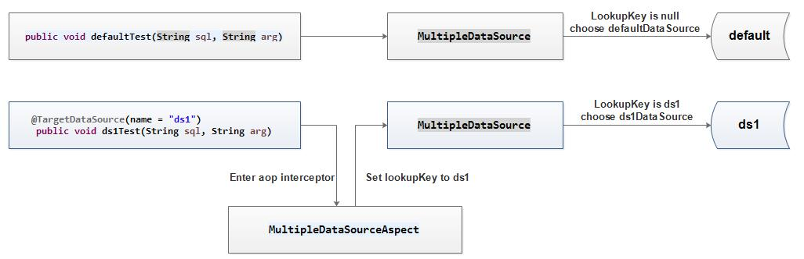

# aop-multiple-datasource
在spring boot中absractRoutingDataSource类可以用来实现数据库的动态切换，而在很多业务场景也确实需要进行数据库切换
- 数据库读写分离，查询操作在读库上，而增删改在写库上，能够极大的提高数据库并发性能
- 业务在数据库级别的解构，微服务架构下，每个独立的服务，都有自己的数据库，然后很多时候，业务会涉及多个多个数据库

在实际项目中，我们刚好要涉及以上业务场景，在网上找了很多这方面的资料，都不太满意，因此决定自己来实现，具体效果可以运行测试

> DataSourceRegisterTest.java

```java
@FixMethodOrder(MethodSorters.NAME_ASCENDING)
public class DataSourceRegisterTest {
    @Rule
    public OutputCapture outputCapture = new OutputCapture();

    @Test
    public void case1_defaultTest() {
        String sn = "000001";
        String sql = "select no from tbl_admin where no=? limit 1";
        AopMultipleDataSourceApplication.main(new String[] {"default", sql, sn});
        String output = this.outputCapture.toString();
        assertThat(output).contains(sn);
    }

    @Test
    public void case2_ds1Test() {
        String username = "admin-test";
        String sql = "select username from tbl_admin where username=? limit 1";
        AopMultipleDataSourceApplication.main(new String[] {"ds1", sql, username});
        String output = this.outputCapture.toString();
        assertThat(output).contains(username);
    }

    @Test
    public void case3_ds2Test() {
        String realname = "gongdexing";
        String sql = "select realname from tbl_admin where realname=? limit 1";
        AopMultipleDataSourceApplication.main(new String[] {"ds2", sql, realname});
        String output = this.outputCapture.toString();
        assertThat(output).contains(realname);
    }
}
```
> Test.java

```java
@Service
public class Test {
    @Autowired
    private JdbcTemplate jdbcTemplate;


    public void defaultTest(String sql, String arg) {
        System.out.println(jdbcTemplate.queryForObject(sql, String.class, arg));
    }

    @TargetDataSource(name = "ds1")
    public void ds1Test(String sql, String arg) {
        System.out.println(jdbcTemplate.queryForObject(sql, String.class, arg));
    }

    @TargetDataSource(name = "ds2")
    public void ds2Test(String sql, String arg) {
        System.out.println(jdbcTemplate.queryForObject(sql, String.class, arg));
    }
}

```

> application.yml

```xml
aop:
  multiple:
    datasources:
      default:
        type: com.alibaba.druid.pool.DruidDataSource
        driver-class-name: com.mysql.jdbc.Driver
        url: jdbc:mysql://default:3306/ibook?useUnicode=true&characterEncoding=UTF-8
        username: root
        password: 123456
      ds1:
        type: com.alibaba.druid.pool.DruidDataSource
        driver-class-name: com.mysql.jdbc.Driver
        url: jdbc:mysql://ds1:3306/hainan_bigdata?useUnicode=true&characterEncoding=UTF-8
        username: root
        password: 123456
      ds2:
        type: com.alibaba.druid.pool.DruidDataSource
        driver-class-name: com.mysql.jdbc.Driver
        url: jdbc:mysql://ds2:3306/ibook?useUnicode=true&characterEncoding=UTF-8
        username: root
        password: 123456
```

在application配置好数据库信息后，在需要切换数据库的方法上annotation **@TargetDataSource(name = "{{dataSourceName}}")**, **{{dataSourceName}}**便是**aop.multiple.datasources**的子项，需要特别的注意，一定要配置default数据源。



